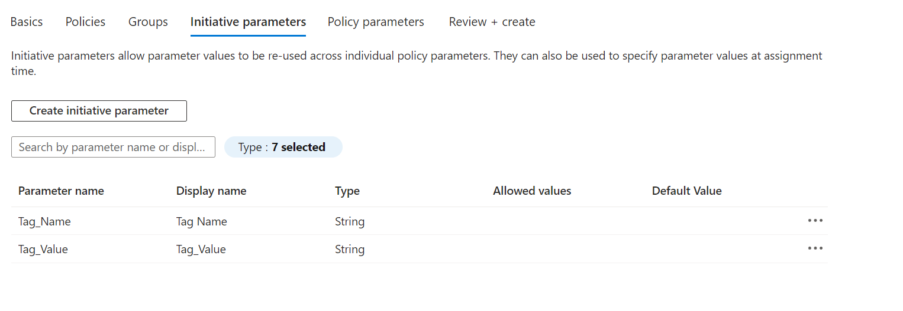

# Writing Your First Initiative with Portal

Azure Policy is a service in Azure that you use to create, assign and manage policies. These policies enforce different rules and effects over your resources, so those resources stay compliant with your corporate standards and service level agreements.

In this post, we'll walk through the steps of creating your first initiative in Azure.

!!! Info
    You need to have a good understanding of Azure Policy before creating an initiative. If you're new to Azure Policy, check out our post on [Azure Policy] and [Writing Your First Policy in Azure with Portal].

[Azure Policy]: 20240224_Azure_Policy.md
[Writing Your First Policy in Azure with Portal]: 20240226_Azure_Policy_first_policy.md

## Prerequisites

1. An active Azure subscription.
2. Access to Azure portal.
3. Azure Policy defined in your subscription, if you don't have one, you can follow the steps in [Writing Your First Policy in Azure with Portal].

## Step 1: Open Azure Policy

- Login to the [Azure Portal](https://portal.azure.com/).
- In the left-hand menu, click on `All services`.
- In the `All services` blade, search for `Policy`.

## Step 2: Create a New Initiative Definition

- Click on `Defitinions` under the `Authoring` section.
- Click on `+ Initiative definition`.

## Step 3: Fill Out the Initiative Definition

You will need to fill out several fields:

- **Basics**:
  - **Initiative location**: The location where the initiative is stored.
  - **Name**: This is a unique name for your initiative.
  - **Description**: A detailed description of what the initiative does.
  - **Category**: You can categorize your initiative for easier searching and filtering.
- **Policies**:
  - **Add policy definition(s)**: Here you can add the policies that will be part of the initiative.
- **Initiative parameters**:
  - **Add parameter**: Here you can add parameters that will be used in the initiative.
  
- **Policy parameters**:
  - **Add policy parameter**: Here you can add parameters that will be used in the policies that are part of the initiative. You can use the parameters defined in the initiative as value for different policies.
  

- Click on `Review + create`: Review the assignment and click on `Create`.

## Step 4: Assign the Initiative

- Go to `Policy` again.
- Go to `Assignments` under the `Authoring` section.
- Click on `+ Assign initiative`.

You will need to fill out several fields:
- **Basics**:
  - **Scope**: Select the scope where you want to assign the initiative.
  - **Basics**: 
    - **Initiative definition**: Select the initiative you just created.
    - **Assignment name**: A unique name for the assignment.
    - **Description**: A detailed description of what the assignment does.
    - **Policy enforcement**: Choose the enforcement mode for the assignment.
- **Parameters**:
  - **Add parameter**: Initialize parameters that will be used in the 
initiative.
- **Remediation**: 
  - **Auto-remediation**: Enable or disable auto-remediation. That means that if a resource is not compliant, it will be remediated automatically. In other post it will be explained how to create a remediation task.
- **Non-compliance messages**:
  - **Non-compliance message**: Define a message that will be shown when a resource is not compliant.

- Click on `Review + create`: Review the assignment and click on `Create`.

## Conclusion

Creating an initiative in Azure Policy is a powerful way to group policies together and enforce them across your Azure environment. By defining initiatives, you can streamline governance, simplify compliance management, and ensure consistent application of policies to your resources. Start creating initiatives today to enhance the security, compliance, and operational efficiency of your Azure environment.

